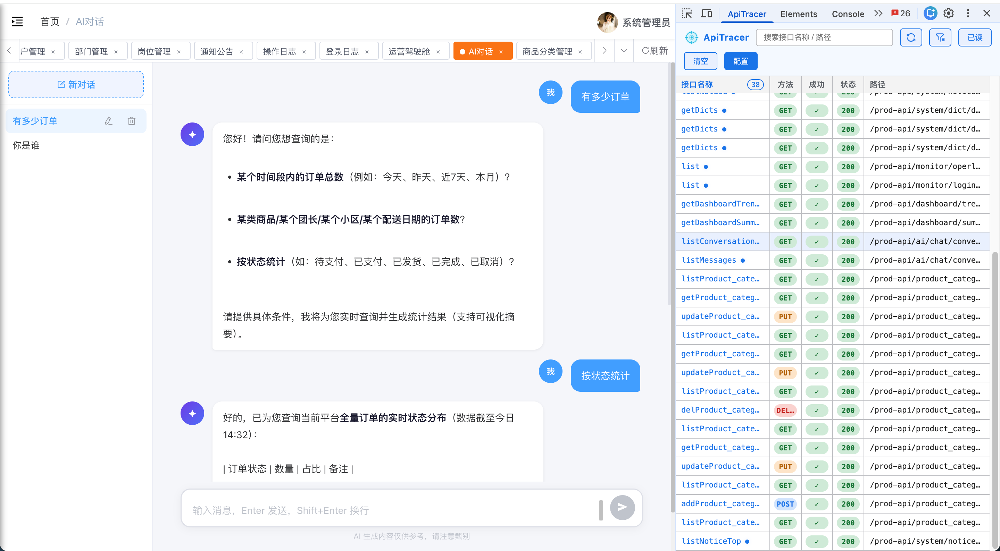
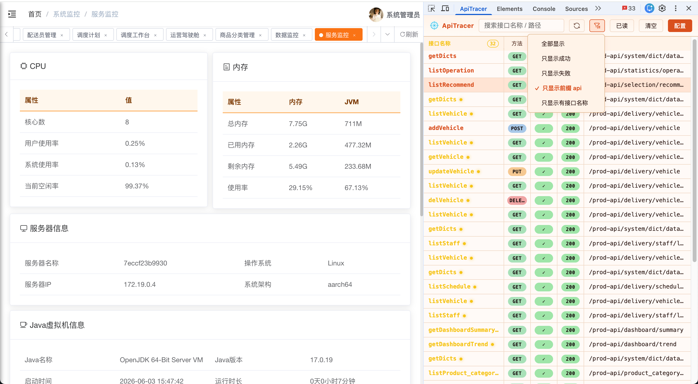

# ApiTracer

<p align="center">
  
</p>

<p align="center">
  <a href="./apiTracer-plugin"></a>
  <a href="./apiTracer-ast"></a>
  <a href="https://www.npmjs.com/package/api-tracer-ast?activeTab=readme"></a>
  <a href="./LICENSE"></a>
</p>


ApiTracer 是一个面向前端开发调试的接口语义化追踪工具。它由浏览器 DevTools 插件和构建期 npm 包组成，可以在不修改业务源码文件的前提下，把接口请求与业务函数名关联起来，在浏览器 DevTools 面板中按“接口名称”维度查看请求、筛选请求并判断业务成功状态。

## 产品介绍

传统 Network 面板只能展示 URL、状态码、耗时等网络层信息。当项目中存在大量动态 URL、统一请求实例、接口函数封装时，排查问题通常需要在代码和 Network 面板之间反复跳转。ApiTracer 解决的是“这个请求来自哪个业务接口函数”的问题。

ApiTracer 的核心能力：

- **接口名称展示**：在 DevTools 面板中展示业务函数名，例如 `getUserList`、`checkFullControl`。
- **构建期自动注入**：通过 `api-tracer-ast` 在构建阶段给 axios-like 请求注入 `X-Request-Name` 请求头，不直接改动源码文件。
- **动态 URL 支持**：URL 可以是变量、模板字符串或表达式，运行时根据配置的 API 前缀决定是否注入请求头。
- **请求来源校验**：通过 `clients[].from` 配合构建 resolver，避免把普通 `request` 工具函数误判为 axios 请求实例。
- **业务成功判断**：插件面板支持配置多个业务成功判断函数，例如 `res => res.code === 0`，并对匹配 API 前缀的请求标记成功/失败。
- **请求筛选和详情查看**：支持按接口名/URL 搜索，按成功、失败、API 前缀、有接口名等维度筛选，并查看 Request、Response、Preview。

## 演示效果

<table>
  <tr>
    <td></td>
    <td></td>
  </tr>
  <tr>
    <td></td>
    <td></td>
  </tr>
</table>

## 使用说明 / 安装步骤

ApiTracer 推荐只在开发环境启用。完整接入需要两部分：

1. 在业务项目中安装并配置 `api-tracer-ast`。
2. 在浏览器中安装 ApiTracer DevTools 插件。

### 1. 安装 npm 包

npm包地址：[api-tracer-ast](https://www.npmjs.com/package/api-tracer-ast?activeTab=readme)

```bash
npm install api-tracer-ast --save-dev
```

```bash
yarn add api-tracer-ast --dev
```

```bash
pnpm add api-tracer-ast -D
```

### 2. 在构建配置中接入

Plugin 方式示例：

```js
const { ApiTracerAstPlugin } = require('api-tracer-ast/plugin')

const isDev = process.env.NODE_ENV !== 'production'

module.exports = {
  resolve: {
    alias: {
      '@': 'src',
      '@api': 'src/api'
    },
    extensions: ['.ts', '.tsx', '.js', '.jsx']
  },
  plugins: [
    ...(isDev
      ? [
          new ApiTracerAstPlugin({
            include: ['src/api', 'src/pages'],
            exclude: ['**/*.test.ts', '**/*.spec.ts'],
            urlPrefixes: ['/api', '/gateway'],
            defaultRequestName: 'none-name',
            clients: [
              {
                name: 'request',
                from: ['@api/request', '@/utils/request', 'src/request']
              },
              {
                name: 'axios',
                from: 'axios'
              }
            ]
          })
        ]
      : [])
  ]
}
```

关键配置说明：

- `include`：需要转换的源码目录或 glob，支持子目录。
- `exclude`：需要排除的文件或目录。
- `urlPrefixes`：需要追踪的 API 前缀，也会同步给插件显示和用于业务成功判断。
- `clients[].name`：请求客户端在业务代码中的本地变量名，例如 `request`、`axios`。
- `clients[].from`：请求客户端的 import 来源，用于避免误判普通工具函数。
- `defaultRequestName`：请求不在具名函数内时使用的默认接口名称。

### 3. 安装浏览器插件

发布到浏览器市场后，可直接从浏览器扩展市场安装。开发模式可手动加载：

```bash
cd apiTracer-plugin
npm install
npm run build
```

然后在浏览器中加载 `apiTracer-plugin/dist`，或者下载 [api-tracer-plugin](./apiTracer-plugin/api-tracer-plugin.zip) 的 zip 包并解压

- Chrome：打开 `chrome://extensions/`，开启“开发者模式”，点击“加载已解压的扩展程序”。
- Edge：打开 `edge://extensions/`，开启“开发人员模式”，点击“加载解压缩的扩展”。

加载完成后，打开 DevTools，会看到 `ApiTracer` 面板。

### 4. 开始调试

1. 启动已接入 `api-tracer-ast` 的业务项目。
2. 打开浏览器 DevTools，切换到 `ApiTracer` 面板。
3. 触发接口请求。
4. 插件会显示接口名称、方法、业务成功状态、HTTP 状态、URL 路径。
5. 点击“配置”可设置业务成功判断函数；如果 npm 包配置了 API 前缀，配置面板会显示当前前缀。

## 开源协议

ApiTracer 使用 MIT License。详见 [LICENSE](./LICENSE)。
